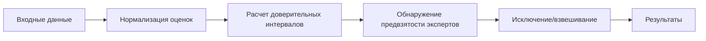

# 🎯 Anti-Biased Group Decision Making Framework


## 📖 О проекте

🔍 **Anti-Biased Group Decision Making Framework** — это реализация алгоритма из научной [статьи](https://sci-hub.ru/https://doi.org/10.1016/j.eswa.2021.114597) *"A decision support system for detecting and handling biased decision-makers in multi criteria group decision-making problems"* (Rabiee et al., 2021) на языке Python.

🚀 **Основная цель**: автоматическое обнаружение и обработка предвзятости экспертов в процессах группового принятия решений.

## ✨ Ключевые возможности

| Функция | Описание |
|---------|-----------|
| **Обнаружение предвзятости** | Выявление экспертов с недостаточной дискриминационной способностью |
| **Три версии алгоритма** | EABM, MABM, SABM для разных сценариев |
| **Статистический анализ** | Расчет доверительных интервалов и перекрытий |
| **Взвешивание экспертов** | Автоматическое назначение весов на основе согласованности |
| **JSON поддержка** | Удобный формат входных/выходных данных |

## 🏗️ Архитектура решения


## 📋 Входные данные

```json
{
  "alternatives": ["A1", "A2", "A3"],
  "criteria": [
    {"name": "Качество", "type": "positive"},
    {"name": "Стоимость", "type": "negative"}
  ],
  "dms": [
    {
      "id": "Эксперт1",
      "scores": [[0.8, 0.6], [0.7, 0.5], [0.9, 0.4]]
    }
  ]
}
```

## 🔄 Процесс обработки



## 🚀 Запуск программы

### 1. Установка зависимостей


### 2. Запуск примера из статьи

### 3. Тестирование других сценариев

## 📄 Лицензия

Распространяется под лицензией MIT. Подробнее см. в файле [LICENSE](./LICENSE).
