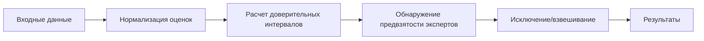

# 🎯 Anti-Biased Group Decision Making Framework


## 📖 О проекте

🔍 **Anti-Biased Group Decision Making Framework** — это реализация алгоритма из научной [статьи](https://sci-hub.ru/https://doi.org/10.1016/j.eswa.2021.114597) *"A decision support system for detecting and handling biased decision-makers in multi criteria group decision-making problems"* (Rabiee et al., 2021) на языке Python. Копию статьи также можно найти [здесь](./docs/rabiee2021.pdf)

🚀 **Основная цель**: автоматическое обнаружение и обработка предвзятости экспертов в процессах группового принятия решений.

## ✨ Ключевые возможности

| Функция | Описание |
|---------|-----------|
| **Обнаружение предвзятости** | Выявление экспертов с недостаточной дискриминационной способностью |
| **Три версии алгоритма** | EABM, MABM, SABM для разных сценариев |
| **Статистический анализ** | Расчет доверительных интервалов и перекрытий |
| **Взвешивание экспертов** | Автоматическое назначение весов на основе согласованности |
| **JSON поддержка** | Удобный формат входных/выходных данных |

## 📂 Структура файлов

```bash
biased-gdm/
├── src/                            # Исходный код
│   ├── bias_handler.py             # Алгоритмы EABM, MABM, SABM
│   ├── cli.py                      # Логика работы CLI
│   ├── main.py                     # Точка входа
│   └── utils.py                    # Вспомогательные функции 
├── docs/
│   └── rabiee2021.pdf              # Исходная статья
│
├── EABM_results_example_data.json  # Результаты работы EABM метода
├── example_data.json               # Пример входных данных из статьи
├── README.md
├── MABM_results_example_data.json  # Результаты работы MABM метода
├── requirements.txt                # Список используемых библиотек
└── SABM_results_example_data.json  # Результаты работы SABM метода
```

## 📋 Входные данные

```json
{
  "alternatives": ["A1", "A2", "A3"],
  "criteria": [
    {"name": "Качество", "type": "positive"},
    {"name": "Стоимость", "type": "negative"}
  ],
  "dms": [
    {
      "id": "Эксперт1",
      "scores": [[0.8, 0.6], [0.7, 0.5], [0.9, 0.4]]
    },
    {
      "id": "Эксперт2",
      "scores": [[0.7, 0.6], [0.6, 0.3], [0.3, 0.8]]
    },
  ]
}
```

## 🔄 Процесс обработки



## 🚀 Запуск программы

### 1. Установка зависимостей

```bash
pip install -r requirements.txt
```

### 2. Запуск примера из статьи

```bash
python .\src\main.py info  # Доступные команды и примеры использования
python .\src\main.py analyze # Запуск EABM на примере из статьи
```

## Версии алгоритма

### EABM (Extreme Anti-Biased Method)

Полное исключение предвзятых экспертов и взвешивание оставшихся.

### MABM (Moderate Anti-Biased Method)

Отличается от метода EABM только фазой распределения весов. Псле исключения предвзятости экспертам назначается вес с использованием минимального порогового значения.

### SABM (Soft Anti-Biased Method)

Отсутствует фаза исключения предвзятости и используется логика распределения весов из метода MABM.

## 📄 Лицензия

Распространяется под лицензией MIT. Подробнее см. в файле [LICENSE](./LICENSE).
