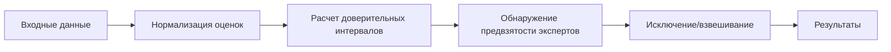
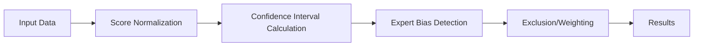

# 🎯 Anti-Biased Group Decision Making Framework


## 📖 О проекте

🔍 **Anti-Biased Group Decision Making Framework** — это модификация алгоритма из научной [статьи](https://sci-hub.ru/https://doi.org/10.1016/j.eswa.2021.114597) *"A decision support system for detecting and handling biased decision-makers in multi criteria group decision-making problems"* (Rabiee et al., 2021) на языке Python. Копию статьи также можно найти [здесь](./docs/rabiee2021.pdf)

🚀 **Основная цель**: автоматическое обнаружение и обработка предвзятости экспертов в процессах группового принятия решений.

Научный руководитель проекта: старший преподаватель ВШПИ, ИКНК, СПбПУ Пархоменко В. А.

## ✨ Ключевые возможности

| Функция | Описание |
|---------|-----------|
| **Обнаружение глобальной предвзятости** | Выявление экспертов с систематическим смещением оценок (недостаточная дискриминационная способность) |
| **Обнаружение локальной предвзятости** | Выявление экспертов с предвзятостью к конкретным альтернативам (избирательное завышение/занижение оценок) |
| **Визуализация предвзятостей** | Визуализация индексов и доверительных интервалов глобальной предвзятости, индексов и отклонения оценок экспертов по выбранной альтернативе и критерию локальной предвзятости |
| **Три версии алгоритма** | EABM, MABM, SABM с разными подходами к обнаружению глобальной предвзятости |
| **Статистический анализ** | Расчет доверительных интервалов и перекрытий для определения уровня согласованности |
| **Взвешивание экспертов** | Автоматическое назначение весов на основе согласованности оценок |
| **JSON поддержка** | Удобный формат входных/выходных данных |

## 📂 Структура проекта

```bash
biased-gdm/
├── docs/
│   └── rabiee2021.pdf              # Исходная статья
│
├── images/                         # Визуализация предвзятосетй экспертов
│
├── src/                            # Исходный код
│   ├── bias_handler.py             # Алгоритмы EABM, MABM, SABM
│   ├── cli.py                      # Логика работы CLI
│   ├── enhanced_bias_handler.py    # Определение локальной предвзятости
│   ├── main.py                     # Точка входа
│   └── utils.py                    # Вспомогательные функции 
│
├── synthetic_data/                 # Синтетические датасеты для анализа предвзятостей экспертов (.json)
│   └── results/                    # Результаты анализа предвзятостей экспертов (.json)
│
├── EABM_results_example_data.json  # Результаты работы EABM метода для данных из статьи
├── example_data.json               # Пример входных данных из статьи
├── README.md
├── MABM_results_example_data.json  # Результаты работы MABM метода для данных из статьи
├── requirements.txt                # Список используемых библиотек
└── SABM_results_example_data.json  # Результаты работы SABM метода для данных из статьи
```

## 📋 Входные данные

```json
{
  "alternatives": ["A1", "A2", "A3"],
  "criteria": [
    {"name": "Качество", "type": "positive"},
    {"name": "Стоимость", "type": "negative"}
  ],
  "dms": [
    {
      "id": "Эксперт1",
      "scores": [[0.8, 0.6], [0.7, 0.5], [0.9, 0.4]]
    },
    {
      "id": "Эксперт2",
      "scores": [[0.7, 0.6], [0.6, 0.3], [0.3, 0.8]]
    },
  ],
  "parameters": {
    "alpha": 0.95,
    "B": 2,
    "gamma": 0.5,
    "L": 0.30
  }
}
```

## 🔄 Процесс обработки



## 🚀 Запуск программы

### 1. Создание .venv

```bash
python -m venv .venv

# Windows
.venv\Scripts\activate
# Unix
source .venv/bin/activate
```

### 2. Установка зависимостей

```bash
pip install -r requirements.txt
```

### 3. Запуск примера из статьи

```bash
python .\src\main.py info    # Доступные команды и примеры использования
python .\src\main.py analyze # Запуск EABM на примере из статьи
```

## Версии алгоритма

### EABM (Extreme Anti-Biased Method)

Полное исключение предвзятых экспертов и взвешивание оставшихся.

### MABM (Moderate Anti-Biased Method)

Отличается от метода EABM только фазой распределения весов. Псле исключения предвзятости экспертам назначается вес с использованием минимального порогового значения (доля от общего веса, равномерно распределяемая между непредвзятыми экспертами).

### SABM (Soft Anti-Biased Method)

Отсутствует фаза исключения предвзятости и используется логика распределения весов из метода MABM.

## 📄 Лицензия

Распространяется под лицензией MIT. Подробнее см. в файле [LICENSE](./LICENSE).

## 📖 About the Project

🔍 **Anti-Biased Group Decision Making Framework** — is a modification of the algorithm from the [article](https://sci-hub.ru/https://doi.org/10.1016/j.eswa.2021.114597) *"A decision support system for detecting and handling biased decision-makers in multi criteria group decision-making problems"* (Rabiee et al., 2021) in Python. A copy of the article can also be found [here](./docs/rabiee2021.pdf)

🚀 **Main objective**: Automatic detection and processing of expert bias in group decision-making processes.

The project advisor and contributor is Vladimir A. Parkhomenko, a senior lecturer at the SPbPU ICSC.

## ✨ Key Features

| Feature | Description |
|---------|-----------|
| **Global Bias Detection** | Identification of experts with systematic score bias (insufficient discriminatory ability) |
| **Local Bias Detection** | Identification of experts biased towards specific alternatives (selective score inflation/deflation) |
| **Bias Visualization** | Visualization of global bias indices and confidence intervals, expert score indices and deviation for a selected alternative and criterion of local bias |
| **Three Algorithm Versions** | EABM, MABM, SABM with different approaches to global bias detection |
| **Statistical Analysis** | Calculation of confidence intervals and overlaps to determine consistency level |
| **Expert Weighting** | Automatic weight assignment based on score consistency |
| **JSON Support** | Convenient input/output data format |

## 📂 Project Structure

```bash
biased-gdm/
├── docs/
│   └── rabiee2021.pdf              # Original paper
│
├── images/                         # Visualization of expert biases
│
├── src/                            # Source code
│   ├── bias_handler.py             # EABM, MABM, SABM algorithms
│   ├── cli.py                      # CLI logic
│   ├── enhanced_bias_handler.py    # Local bias definition
│   ├── main.py                     # Entry point
│   └── utils.py                    # Utility functions 
│
├── synthetic_data/                 # Synthetic datasets for expert bias analysis (.json)
│   └── results/                    # Results of expert bias analysis (.json)
│
├── EABM_results_example_data.json  # EABM method results for the data from the paper
├── example_data.json               # Example input data from the paper
├── README.md
├── MABM_results_example_data.json  # MABM method results for the data from the paper
├── requirements.txt                # List of used libraries
└── SABM_results_example_data.json  # SABM method results for the data from the paper
```

## 📋 Input Data

```json
{
  "alternatives": ["A1", "A2", "A3"],
  "criteria": [
    {"name": "Качество", "type": "positive"},
    {"name": "Стоимость", "type": "negative"}
  ],
  "dms": [
    {
      "id": "Эксперт1",
      "scores": [[0.8, 0.6], [0.7, 0.5], [0.9, 0.4]]
    },
    {
      "id": "Эксперт2",
      "scores": [[0.7, 0.6], [0.6, 0.3], [0.3, 0.8]]
    },
  ],
  "parameters": {
    "alpha": 0.95,
    "B": 2,
    "gamma": 0.5,
    "L": 0.30
  }
}
```

## 🔄 Processing Pipeline



## 🚀 Running the Program

### 1. Create .venv

```bash
python -m venv .venv

# Windows
.venv\Scripts\activate
# Unix
source .venv/bin/activate
```

### 2. Install Dependencies

```bash
pip install -r requirements.txt
```

### 3. Run the Example from the Paper

```bash
python .\src\main.py info    # Available commands and usage examples
python .\src\main.py analyze # Run EABM on the example from the paper
```

## Algorithm Versions

### EABM (Extreme Anti-Biased Method)

Complete exclusion of biased experts and weighting of the remaining ones.

### MABM (Moderate Anti-Biased Method)

Differs from the EABM method only in the weight distribution phase. After bias exclusion, experts are assigned a weight using a minimum threshold value (a share of the total weight, uniformly distributed among non-biased experts).

### SABM (Soft Anti-Biased Method)

Omits the bias exclusion phase and uses the weight distribution logic from the MABM method.

## 📄 License

Distributed under the MIT License. See the [LICENSE](./LICENSE) file for details.
